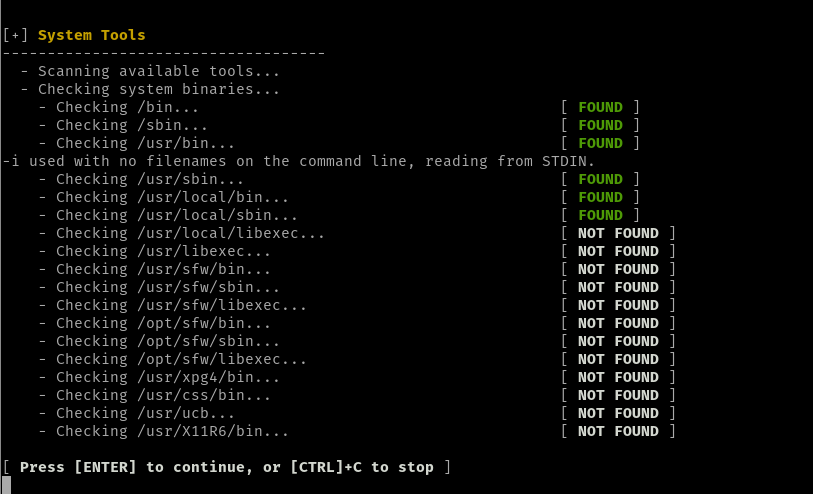

## Bloque 2 - Herramientas del sistema

En este apartado comprueba las herramientas que tiene el sistema y detecta el propio programa. Comprobando la existencia de los directorios tales como `/bin` o `/sbin`, que son donde se almacenan todos los binarios necesarios para garantizar las funciones básicas a nivel de usuario, en el primer caso, y los binarios necesarios para tareas administrativas gestionadas por el usuario `root` o `superusuario` en el caso del segundo.

Vemos también el directorio `/usr/`, este directorio contiene todo el software instalado por el usuario a través del gestor de paquetes. Observamos que hay varias localizaciones que no encuentran porque no están en el sistema:

- `/usr/libexec` y relacionados, aquí se suelen incluir binarios internos que no están destinados a ser ejecutados directamente por los usuarios finales, si no por programas que hagan uso de ellos.

- `/usr/sfw/` y relacionados, igual que el anterior pero para otras distribuciones de Linux que hacen uso de esta ruta (p.e. `Solaris`).

-`/usr/xpg4/`, `/usr/css/` y  `/usr/ucb` , igual que las anteriores pero que cumplen otros estándares de compilación de los programas, además de algunas herramientas para desarrolladores.

- `/usr/X11R6/bin`, ficheros binarios pertenecientes al sistema X-Windows que se usa para las interfaces gráficas.

Directorios de la rama `/opt/`, aquí van los archivos de solo lectura de programas autocontenidos y no siguen los criterios de almacenar sus archivos en alguno de los directorios de la rama `usr`.